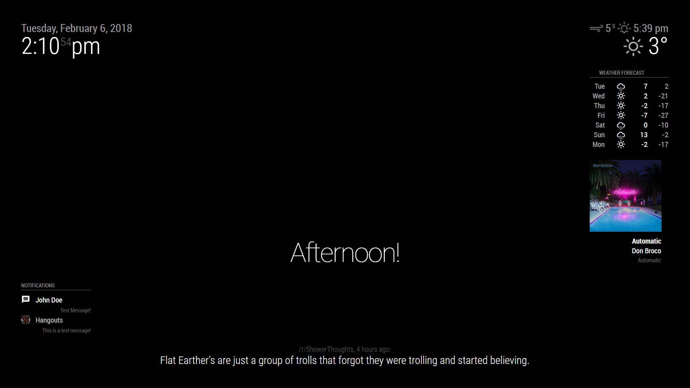

# Module: PushBulletNotes

This is a module for the [MagicMirror²](https://github.com/MichMich/MagicMirror/).

This module will display new phone notifications onto your mirror using the PushBullet API.
This module is heavily drawn from GitHub user ronny3050's [Phone Notification Mirror](https://github.com/ronny3050/phone-notification-mirror), which stopped working a little under 9 months ago after PushBullet made a major update to their API. The general design is similar, although it has been cleaned up and adapted to fit the new API.




## API Token
You will need a [PushBullet](https://www.pushbullet.com/) app installed on your device. Once you have the app set up on your phone, you can get a PushBullet Access Token token from your Account Settings.

## Installing
Clone this repository into your __modules__ folder: `git clone https://github.com/maliciousBanjo/PushBulletNotes.git`

`cd PushBulletNotes` and run `npm install` to install the necessary dependencies.

## Dependencies
   * [PushBullet](https://www.npmjs.com/package/pushbullet)

## Development Status
Maintained, will try to tweak according to user feedback.

## Using the module

To use this module, add the following configuration block to the modules array in the `config/config.js` file:
```js
var config = {
    modules: [
		{
			module: "PushBulletNotes",
			header: "Notifications",
			disabled: false,
			position: "bottom_left", // Or any valid MagicMirror position.
			config: {
				accessToken: "YOUR ACCESS TOKEN",
				numberOfNotifications: 5,
				displayNotificationIcon: true,
				displayMessage: true,
				displayCount: true,
				fade: true,
				maxMsgCharacters: 50,
				maxHeaderCharacters: 32
			}
		},
    ]
}
```

## Configuration options

<table width="100%">
	<thead>
		<tr>
			<th>Option</th>
			<th width="100%">Description</th>
		</tr>
	<thead>
	<tbody>
		<tr>
			<td><code>accessToken</code></td>
			<td>Your Pushbullet Access Token, accessible through your PushBullet Account Settings<br>
			</td>
		</tr>
		<tr>
			<td><code>numberOfNotifications</code></td>
			<td>Number of notifications to display at a time<br>
				<br><b>Default value:</b> <code>5</code>
				<br>If set to 0, no notification messages will be displayed.
			</td>
		</tr>
		<tr>
			<td><code>showNoticiationIcon</code></td>
			<td>Show the app icon generated by the notification<br>
				<br><b>Possible values:</b> <code>true</code> or <code>false</code>
				<br><b>Default value:</b> <code>true</code>
			</td>
		</tr>
		<tr>
			<td><code>showMessage</code></td>
			<td>Show the body of the notification<br>
				<br><b>Possible values:</b> <code>true</code> or <code>false</code>
				<br><b>Default value:</b> <code>true</code>
			</td>
		</tr>
		<tr>
			<td><code>showCount</code></td>
			<td>Show the notification count<br>
				<br><b>Possible values:</b> <code>true</code> or <code>false</code>
				<br><b>Default value:</b> <code>true</code>
			</td>
		</tr>
		<tr>
			<td><code>maxMsgCharacters</code></td>
			<td>The maximum number of characters to show from the notification body<br>
				<br><b>Default value:</b> <code>50</code>
			</td>
		</tr>
		<tr>
			<td><code>maxHeaderCharacters</code></td>
			<td>The maximum number of characters to show from the notification header<br>
				<br><b>Default value:</b> <code>32</code>
			</td>
		</tr>
</table>